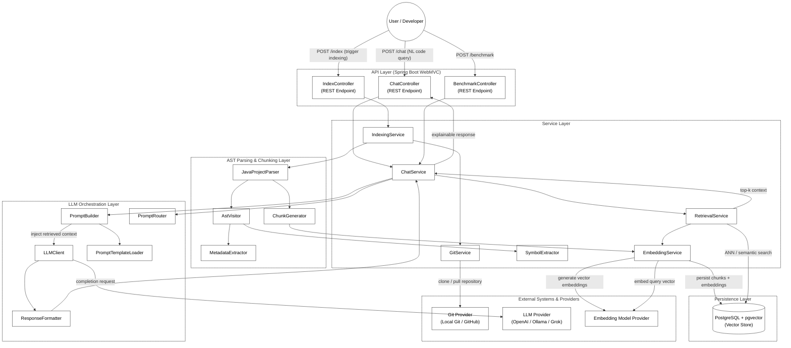

# JCode Intelligence

**AI-powered code comprehension system for Java codebases.** Combines AST-based static analysis with retrieval-augmented generation (RAG) to let developers query a codebase in natural language and get grounded, explainable answers.

---

## Why This Project Matters

Understanding an unfamiliar Java codebase is one of the most time-consuming parts of onboarding, code review, and maintenance. JCode Intelligence addresses this by treating source code as structured, queryable knowledge rather than plain text — parsing it into a semantic representation, indexing it as vector embeddings, and using an LLM to reason over the retrieved context.

**Core capabilities:**

- **Structural parsing** — Extracts packages, classes, interfaces, and methods via `JavaParser`, preserving hierarchy instead of flattening code into raw text.
- **Semantic chunking** — Splits code along logical boundaries (class/method level) so retrieved context is coherent, not arbitrarily truncated.
- **Vector search at scale** — Stores embeddings in PostgreSQL via `pgvector`, enabling fast approximate nearest-neighbor (ANN) search over large codebases.
- **RAG-based Q&A** — Natural language questions (e.g., *"How does the authentication flow work?"*) are answered using top-K retrieved code context fed into an LLM, with provider flexibility across OpenAI, Ollama, and Grok.
- **One-command indexing** — Points at a local repo or clones directly from a Git provider to build the searchable index.
- **Benchmarking endpoint** — A dedicated `/benchmark` API for quantitative evaluation of LLM response fidelity, latency, and retrieval relevance.

---

## Architecture

Designed with clean separation of concerns across four layers: **API → Service → Parsing → LLM Orchestration**, backed by a vector-native persistence layer.



| Workflow | Trigger | Path |
|---|---|---|
| **Indexing** | `POST /index` | Clone/read repo → parse AST → chunk → embed → persist to `pgvector` |
| **Query** | `POST /chat` | Embed query → ANN search → retrieve top-K context → build & route prompt → LLM completion → formatted response |
| **Benchmark** | `POST /benchmark` | Runs evaluation queries through the chat pipeline, measuring response fidelity, latency, and retrieval relevance |

---

## Tech Stack

| Layer | Technology |
|---|---|
| Language / Runtime | Java 21 |
| Framework | Spring Boot (WebMVC), Spring AI |
| Code Parsing | JavaParser (AST-level) |
| Vector Database | PostgreSQL + pgvector |
| LLM / Embeddings | OpenAI, Grok, Ollama (pluggable) |

---

## Validation: Indexing the JavaParser Codebase

To validate correctness and scalability on a real, non-trivial codebase, JCode Intelligence was run end-to-end against the [JavaParser](https://github.com/javaparser/javaparser) project itself.

**Indexing statistics:**

| Metric | Value |
|---|---|
| Packages | 91 |
| Classes | 1,757 |
| Interfaces | 189 |
| Enums | 53 |
| Fields | 3,191 |
| Constructors | 1,821 |
| Methods | 19,768 |
| Total chunks generated | 27,079 |
| Largest class parsed | `ASTParser` (334,531 chars) |
| Total indexing time | ~14.7 minutes (881,082 ms) |


**Sample query result** (actual system output — `content` fields truncated for readability):

```json
{
  "query": "Where is LexicalPreservingPrinter implemented?",
  "answer": "The LexicalPreservingPrinter is implemented in the com.github.javaparser.printer.lexicalpreservation package. It is a concrete class named LexicalPreservingPrinter.",
  "sources": [
    {
      "type": "CLASS",
      "repositoryId": "javaparser",
      "packageName": "com.github.javaparser.printer.lexicalpreservation",
      "className": "LexicalPreservingPrinter",
      "elementName": "LexicalPreservingPrinter",
      "filePath": ".../javaparser-core/src/main/java/com/github/javaparser/printer/lexicalpreservation/LexicalPreservingPrinter.java",
      "startLine": 73,
      "endLine": 934,
      "content": "package com.github.javaparser.printer.lexicalpreservation;\n\n// ... imports omitted ...\n\npublic class LexicalPreservingPrinter {\n    // Fields\n    private static String JAVA_UTIL_OPTIONAL;\n    private static String JAVAPARSER_AST_NODELIST;\n    private static AstObserver observer;\n    public static final DataKey<NodeText> NODE_TEXT_DATA;\n\n    // Methods\n    public static N setup(N node)\n    public static boolean isAvailableOn(Node node)\n    public static String print(Node node)\n    static NodeText getOrCreateNodeText(Node node)\n    // ... additional methods omitted ...\n}"
    },
    {
      "type": "FIELD",
      "className": "LexicalPreservingPrinter",
      "elementName": "NODE_TEXT_DATA",
      "signature": "public static final DataKey<NodeText> NODE_TEXT_DATA = new DataKey<NodeText>() {};",
      "startLine": 89,
      "endLine": 89
    }
  ]
}
```

This confirms the retrieval pipeline grounds responses to exact class-, field-, and line-level locations across a 1,700+ class codebase — returning structured, verifiable source references rather than a free-text guess.

---

## Engineering Highlights

- **Provider-agnostic LLM/embedding layer** — swap between OpenAI, Ollama, or Grok without touching business logic, via a clean `LLMClient` abstraction.
- **Structure-aware retrieval** — chunking respects code semantics (class/method boundaries) rather than fixed-size text windows, improving retrieval precision over naive RAG.
- **Layered, testable architecture** — strict separation between REST controllers, services, parsing, and prompt orchestration keeps components independently unit-testable.