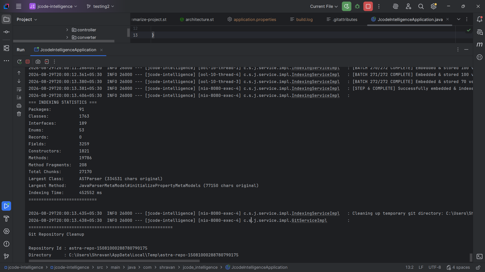
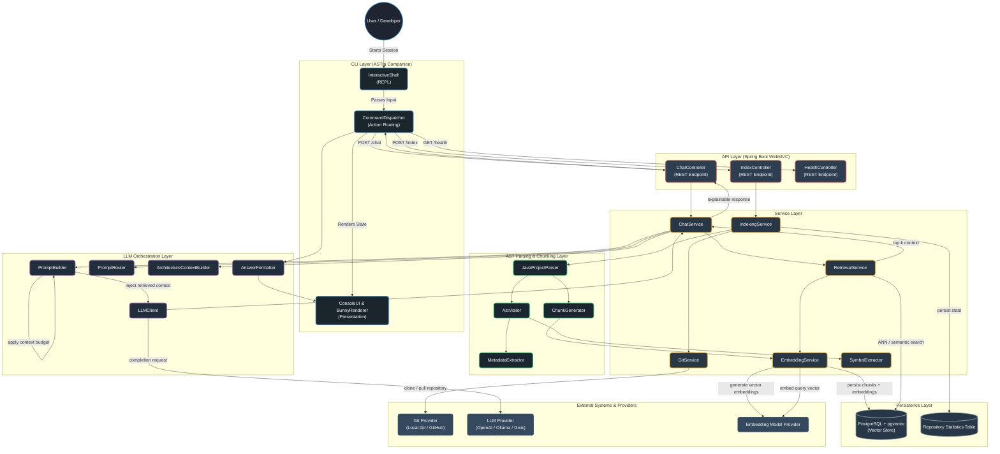

# ASTra

## Your codebase, understood.

> **Parse the structure. Find the context. Understand the code.**

ASTra parses Java codebases at the AST level and turns them into a searchable, semantic index you can query in plain English - classes, methods, dependencies, architecture, workflows, all of it.

---

## Proof, Not Promises

ASTra was run end-to-end against the [JavaParser](https://github.com/javaparser/javaparser) codebase - a real, non-trivial project with over 1,700 classes.

| Metric | Value |
|---|---|
| Packages | 91 |
| Classes | 1,763 |
| Interfaces | 189 |
| Enums | 53 |
| Fields | 3,259 |
| Constructors | 1,821 |
| Methods | 19,786 |
| Total chunks generated | 27,170 |
| Largest class parsed | `ASTParser` (334,531 chars) |
| Indexing time (before optimization) | ~14.7 minutes (881,082 ms) |
| Indexing time (after adaptive batching + multithreading) | **~7.5 minutes (452,552 ms)** |

**~49% faster** - from a full sequential pass on a single request thread to a parallelized, adaptively-batched pipeline distributed across a dedicated worker pool, on the same JavaParser codebase.



> **Multithreading, proven in the logs, not just claimed:** pre-optimization batches ran serially on a single thread (`nio-8080-exec-2`); post-optimization batches are distributed across a dedicated worker pool (`ool-10-thread-1`, `ool-10-thread-3`, `ool-10-thread-4`), executing concurrently. Class/field/method counts differ slightly between the two runs since each was indexed from a fresh clone at a different commit.

**Ask it a real question, get a grounded answer** - actual system output, `content` fields truncated for readability:

```json
{
  "query": "Where is LexicalPreservingPrinter implemented?",
  "answer": "The LexicalPreservingPrinter is implemented in the com.github.javaparser.printer.lexicalpreservation package. It is a concrete class named LexicalPreservingPrinter.",
  "sources": [
    {
      "type": "CLASS",
      "repositoryId": "javaparser",
      "packageName": "com.github.javaparser.printer.lexicalpreservation",
      "className": "LexicalPreservingPrinter",
      "elementName": "LexicalPreservingPrinter",
      "filePath": ".../javaparser-core/src/main/java/com/github/javaparser/printer/lexicalpreservation/LexicalPreservingPrinter.java",
      "startLine": 73,
      "endLine": 934,
      "content": "package com.github.javaparser.printer.lexicalpreservation;\n\n// ... imports omitted ...\n\npublic class LexicalPreservingPrinter {\n    // Fields\n    private static String JAVA_UTIL_OPTIONAL;\n    private static String JAVAPARSER_AST_NODELIST;\n    private static AstObserver observer;\n    public static final DataKey<NodeText> NODE_TEXT_DATA;\n\n    // Methods\n    public static N setup(N node)\n    public static boolean isAvailableOn(Node node)\n    public static String print(Node node)\n    static NodeText getOrCreateNodeText(Node node)\n    // ... additional methods omitted ...\n}"
    },
    {
      "type": "FIELD",
      "className": "LexicalPreservingPrinter",
      "elementName": "NODE_TEXT_DATA",
      "signature": "public static final DataKey<NodeText> NODE_TEXT_DATA = new DataKey<NodeText>() {};",
      "startLine": 89,
      "endLine": 89
    }
  ]
}
```

No hallucinated guesses - exact class, field, and line-level references across a 1,700+ class codebase.

---

## API Surface

ASTra runs as a full Spring Boot REST service - every capability above is exposed as an endpoint, not just a CLI feature:

| Method | Endpoint | Description |
|---|---|---|
| `POST` | `/api/v1/index` | Unified indexing - pass either a `gitUrl` or a local `projectPath`, ASTra routes to the right pipeline automatically |
| `POST` | `/api/v1/index/local` | Index a project from a local directory path |
| `POST` | `/api/v1/index/git` | Clone and index a project directly from a Git URL |
| `POST` | `/api/v1/chat` | Ask a natural-language question and get a grounded, source-referenced answer |
| `GET` | `/api/v1/repositories` | List all currently indexed repositories |
| `GET` | `/api/v1/repositories/{id}/stats` | Get indexing stats (classes, methods, chunks, etc.) for a specific repository |
| `DELETE` | `/api/v1/repositories/{id}` | Remove an indexed repository |
| `POST` | `/api/v1/benchmark/run` | Run automated retrieval-quality benchmarks and get pass/fail accuracy + latency metrics |
| `GET` | `/api/v1/health` | Health check for the running ASTra instance |

**Index a local folder instead of a GitHub repo - same endpoint, same pipeline:**

```bash
# From a local directory
curl -X POST http://localhost:8080/api/v1/index \
  -H "Content-Type: application/json" \
  -d '{ "projectPath": "C:/projects/my-java-app", "repositoryId": "my-java-app" }'

# Directly from GitHub
curl -X POST http://localhost:8080/api/v1/index \
  -H "Content-Type: application/json" \
  -d '{ "gitUrl": "https://github.com/javaparser/javaparser", "repositoryId": "javaparser" }'
```

ASTra also ships a built-in **retrieval quality benchmark** - `POST /api/v1/benchmark/run` fires a set of test queries at an indexed repo and reports intent-match accuracy and average latency, so retrieval quality isn't just a claim, it's a number you can regenerate yourself.

---

## Query Modes

ASTra doesn't just answer generic questions - it exposes purpose-built commands for the ways developers actually navigate unfamiliar code:

| Command | What It Does |
|---|---|
| `ask` | Ask any natural-language question about the active repository |
| `class` | Explain a specific class - responsibilities, fields, methods |
| `method` | Explain a specific method - logic, parameters, return behavior |
| `architecture` | Explain the architecture of the repository, or drill into a single component |
| `workflow` | Trace and explain a workflow or process end-to-end |
| `dependencies` | List dependencies, or find everything that uses a given class/method |
| `calls` | Find every caller of a specific method or class |
| `search` | Locate a specific code element across the entire repository |
| `summary` | Get a high-level summary of the whole project |
| `design` | Surface the design patterns and principles in use |

Each command runs through the same AST-grounded retrieval pipeline - so whether you're asking "what calls this method" or "summarize this project," the answer traces back to exact classes, files, and line numbers, not a generic guess.

---

## Core Capabilities

- **Structural parsing** - Walks the abstract syntax tree of each compilation unit to extract packages, classes, interfaces, enums, and methods, resolving symbols via a type-aware symbol table so hierarchy and cross-references are preserved instead of flattened into raw text.
- **Semantic chunking** - Splits code along logical boundaries (class/method level) so retrieved context is coherent, not arbitrarily truncated.
- **Vector search at scale** - Embeddings stored in PostgreSQL via `pgvector`, enabling fast approximate nearest-neighbor (ANN) search over large codebases.
- **Adaptive batch processing** - Multithreaded, with batch sizes that adjust dynamically to cut indexing time significantly (see benchmark above).
- **Natural language Q&A** - Top-K retrieved code context feeds an LLM under a strict token budget, with provider flexibility across OpenAI, Ollama, and Grok.
- **Interactive terminal companion** - A Windows-native CLI with an animated ASCII bunny, built as a fully decoupled thin client over the REST API.
- **One-command indexing** - Point it at a local repo or clone directly from a Git provider.

---

## Architecture

Five layers, cleanly separated: **CLI → API → Service → Parsing → LLM Orchestration**, backed by a vector-native persistence layer.



| Workflow | Trigger | What Actually Happens |
|---|---|---|
| **Indexing** | `POST /index` | Clones or reads the target repo, walks the AST of every file, chunks code at class/method boundaries, generates vector embeddings, and persists everything to `pgvector` with full stats tracked in `repository_statistics` - no manual prep required. |
| **Query** | `POST /chat` | Embeds your question, runs ANN search across the entire indexed codebase, retrieves the top-K most relevant chunks, builds a budgeted prompt with routing logic, and returns an LLM-grounded answer with exact source references. |
| **CLI Interaction** | `astra.bat` | Drives the full REST API from a live REPL - commands route through `CommandDispatcher`, responses are formatted by `AnswerFormatter`, and rendered through `ConsoleUI` for a fast, native terminal experience. |

---

## Tech Stack

| Layer | Technology |
|---|---|
| Language / Runtime | Java 21 |
| Framework | Spring Boot (WebMVC), Spring AI |
| CLI Environment | Windows Terminal / Console (Native `astra.bat`) |
| Code Parsing | JavaParser (AST-level) |
| Vector Database | PostgreSQL + pgvector |
| LLM / Embeddings | OpenAI, Grok, Ollama (pluggable) |

---

## Getting Started

### Prerequisites
- **Java 21**
- **Docker & Docker Compose** (for PostgreSQL + pgvector)
- **Ollama** installed locally (for generating text embeddings)
- **Groq API Key** (for the LLM completion engine)

### 1. Start the Database
ASTra relies on PostgreSQL with the pgvector extension for storing and querying embeddings. Start the database using the provided `compose.yaml`:

```bash
docker compose up -d
```
*Note: The Docker container maps to port 5432 and sets up the `jcode_db` database with default credentials.*

### 2. Set Up Local Embeddings
The system is configured to use Ollama to locally generate embeddings. Pull the required `nomic-embed-text` model:

```bash
ollama pull nomic-embed-text
```

### 3. Configure API Keys
Update your `application.properties` (or environment variables) to include your Groq API key for the LLM chat completion:

```properties
spring.ai.openai.api-key=your_groq_api_key_here
```

### 4. Build and Run
Build the project and start the Spring Boot application:

```bash
.\mvnw.cmd clean install
.\mvnw.cmd spring-boot:run
```

### 5. Launch the CLI Companion
In a new terminal window, start the ASTra interactive shell:

```bash
.\astra.bat
```