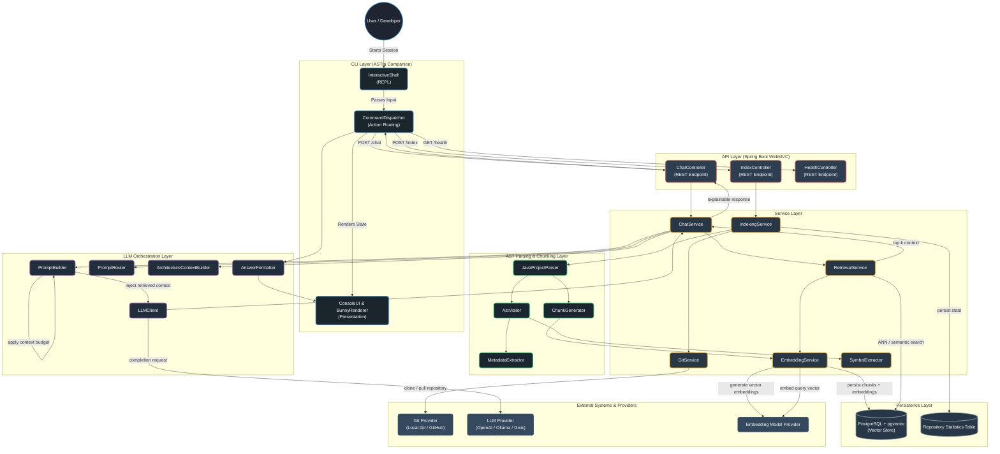
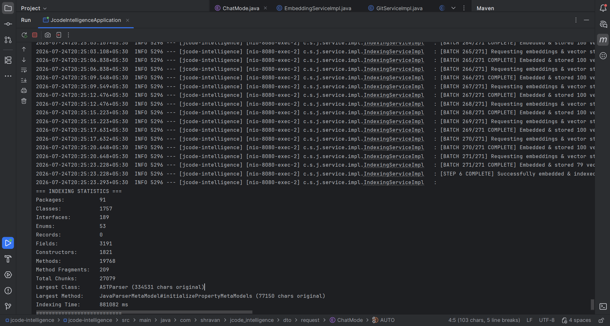

# ASTra

## Your codebase, understood.

> **Parse the structure. Find the context. Understand the code.**

ASTra is an intelligent Java code comprehension system that analyzes Java
codebases at the AST level and builds a searchable understanding of their
classes, methods, dependencies, relationships, architecture, workflows, and many more.

Instead of digging through thousands of files, ask ASTra questions about your
codebase and explore it through a natural-language interface and an
interactive CLI.
---

## Why This Project Matters

Understanding an unfamiliar Java codebase is one of the most time-consuming parts of onboarding, code review, and maintenance. JCode Intelligence addresses this by treating source code as structured, queryable knowledge rather than plain text: parsing it into a semantic representation, indexing it as vector embeddings, and using an LLM to reason over the retrieved context.

**Core capabilities:**

- **Structural parsing** - Extracts packages, classes, interfaces, and methods via `JavaParser`, preserving hierarchy instead of flattening code into raw text.
- **Semantic chunking** - Splits code along logical boundaries (class/method level) so retrieved context is coherent, not arbitrarily truncated.
- **Vector search at scale** - Stores embeddings in PostgreSQL via `pgvector`, enabling fast approximate nearest-neighbor (ANN) search over large codebases.
- **Adaptive Batch Processing** - Backed by multithreading, intelligent batch sizes dynamically adjust to reduce batch processing and indexing time by ~15%.
- **Semantic search** - Natural language questions are answered using top-K retrieved code context fed into an LLM, respecting strict token budgets, with provider flexibility across OpenAI, Ollama, and Grok.
- **Interactive Terminal Companion** - A rich, Windows-native CLI layer featuring an animated ASCII bunny companion, providing an engaging and highly functional local developer experience.
- **One-command indexing** - Points at a local repo or clones directly from a Git provider to build the searchable index.

---

## Architecture

Designed with clean separation of concerns across five layers: **CLI, API, Service, Parsing, and LLM Orchestration**, backed by a vector-native persistence layer.



| Workflow | Trigger | Path |
|---|---|---|
| **Indexing** | `POST /index` | Clone/read repo, parse AST, chunk, embed, persist to `pgvector` & `repository_statistics` |
| **Query** | `POST /chat` | Embed query, ANN search, retrieve top-K context, build & route prompt with budgeting, LLM completion, formatted response |
| **CLI Interaction** | `astra.bat` | REPL loop routes commands via `CommandDispatcher`, interacts with REST API, formats response using `AnswerFormatter`, displays via `ConsoleUI` |

---

## Tech Stack

| Layer | Technology |
|---|---|
| Language / Runtime | Java 21 |
| Framework | Spring Boot (WebMVC), Spring AI |
| CLI Environment | Windows Terminal / Console (Native `astra.bat`) |
| Code Parsing | JavaParser (AST-level) |
| Vector Database | PostgreSQL + pgvector |
| LLM / Embeddings | OpenAI, Grok, Ollama (pluggable) |

---

## Validation: Indexing the JavaParser Codebase (before implementing multithreading & Vector Store batch optimization)

To validate correctness and scalability on a real, non-trivial codebase, JCode Intelligence was run end-to-end against the [JavaParser](https://github.com/javaparser/javaparser) project itself.

**Indexing statistics:**

| Metric | Value |
|---|---|
| Packages | 91 |
| Classes | 1,757 |
| Interfaces | 189 |
| Enums | 53 |
| Fields | 3,191 |
| Constructors | 1,821 |
| Methods | 19,768 |
| Total chunks generated | 27,079 |
| Largest class parsed | `ASTParser` (334,531 chars) |
| Total indexing time | ~14.7 minutes (881,082 ms) |



**Sample query result** (actual system output, `content` fields truncated for readability):

```json
{
  "query": "Where is LexicalPreservingPrinter implemented?",
  "answer": "The LexicalPreservingPrinter is implemented in the com.github.javaparser.printer.lexicalpreservation package. It is a concrete class named LexicalPreservingPrinter.",
  "sources": [
    {
      "type": "CLASS",
      "repositoryId": "javaparser",
      "packageName": "com.github.javaparser.printer.lexicalpreservation",
      "className": "LexicalPreservingPrinter",
      "elementName": "LexicalPreservingPrinter",
      "filePath": ".../javaparser-core/src/main/java/com/github/javaparser/printer/lexicalpreservation/LexicalPreservingPrinter.java",
      "startLine": 73,
      "endLine": 934,
      "content": "package com.github.javaparser.printer.lexicalpreservation;\n\n// ... imports omitted ...\n\npublic class LexicalPreservingPrinter {\n    // Fields\n    private static String JAVA_UTIL_OPTIONAL;\n    private static String JAVAPARSER_AST_NODELIST;\n    private static AstObserver observer;\n    public static final DataKey<NodeText> NODE_TEXT_DATA;\n\n    // Methods\n    public static N setup(N node)\n    public static boolean isAvailableOn(Node node)\n    public static String print(Node node)\n    static NodeText getOrCreateNodeText(Node node)\n    // ... additional methods omitted ...\n}"
    },
    {
      "type": "FIELD",
      "className": "LexicalPreservingPrinter",
      "elementName": "NODE_TEXT_DATA",
      "signature": "public static final DataKey<NodeText> NODE_TEXT_DATA = new DataKey<NodeText>() {};",
      "startLine": 89,
      "endLine": 89
    }
  ]
}
```

This confirms the retrieval pipeline grounds responses to exact class-, field-, and line-level locations across a 1,700+ class codebase, returning structured, verifiable source references rather than a free-text guess.

---

## Engineering Highlights

- **Adaptive Batch Processing** - Concurrent thread execution with intelligent batching yields a 15% reduction in total AST parsing and vector ingestion times.
- **Strict Context Budgeting** - Retrieval pipelines enforce a strict token limit to prevent massive architectural contexts from overwhelming LLM limits (e.g., LLaMA-3.3 12k budget).
- **Structure-aware retrieval** - Chunking respects code semantics (class/method boundaries) rather than fixed-size text windows, improving retrieval precision over naive RAG.
- **Separated Presentation Layer** - The CLI maintains a highly animated user experience via `ConsoleUI`, `BunnyRenderer`, and `AnswerFormatter` while remaining a completely decoupled thin client to the REST API.
- **Provider-agnostic LLM/embedding layer** - Swap between OpenAI, Ollama, or Grok without touching business logic, via a clean `LLMClient` abstraction.

---

## Getting Started

Follow these steps to set up the vector database, local embedding models, and run the application.

### Prerequisites
- **Java 21**
- **Docker & Docker Compose** (for PostgreSQL + pgvector)
- **Ollama** installed locally (for generating text embeddings)
- **Groq API Key** (for the LLM completion engine)

### 1. Start the Database
JCode Intelligence relies on PostgreSQL with the pgvector extension for storing and querying embeddings. Start the database using the provided `compose.yaml`:

```bash
docker compose up -d
```
*Note: The Docker container maps to port 5432 and sets up the `jcode_db` database with default credentials.*

### 2. Set Up Local Embeddings
The system is configured to use Ollama to locally generate embeddings. Pull the required `nomic-embed-text` model:

```bash
ollama pull nomic-embed-text
```

### 3. Configure API Keys
Update your `application.properties` (or environment variables) to include your Groq API key for the LLM chat completion:

```properties
spring.ai.openai.api-key=your_groq_api_key_here
```

### 4. Build and Run
Build the project and start the Spring Boot application:

```bash
.\mvnw.cmd clean install
.\mvnw.cmd spring-boot:run
```

### 5. Launch the CLI Companion
In a new terminal window, start the ASTra interactive shell:

```bash
.\astra.bat
```
